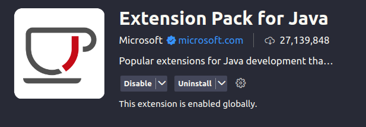
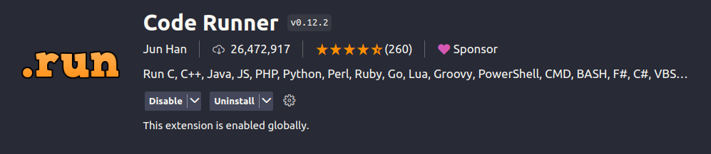

# Install Java on linux ( Ubuntu )
## check the version 
```
apt-cache search openjdk  
```
this will give all the jdk/jre list it has make sure u have a updated system.

## install the updates
```
sudo apt-get install openjdk-22-jre openjdk-22-jdk
```
you can change the 22 with the latest version u have in the list

## Check the installation
```
java --version
```
your output sould be something like this ..
```
openjdk 21.0.2 2024-01-16
OpenJDK Runtime Environment (build 21.0.2+13-Ubuntu-122.04.1)
OpenJDK 64-Bit Server VM (build 21.0.2+13-Ubuntu-122.04.1, mixed mode, sharing)
```
## Install this extention for vscode


If u want it to run not on terminal and a bit more clean then istall this too

